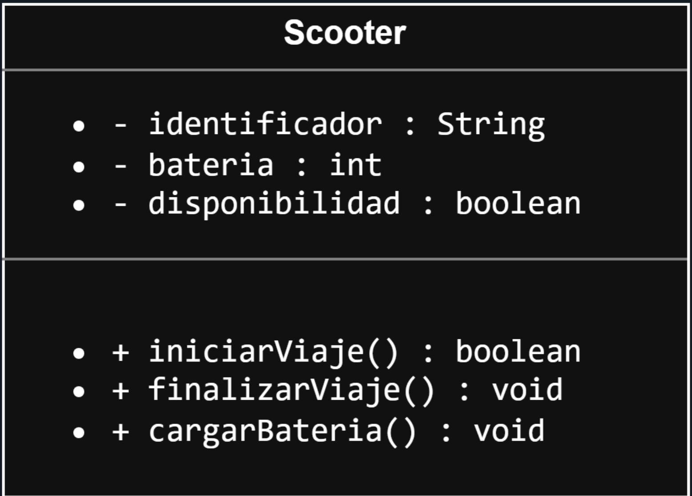
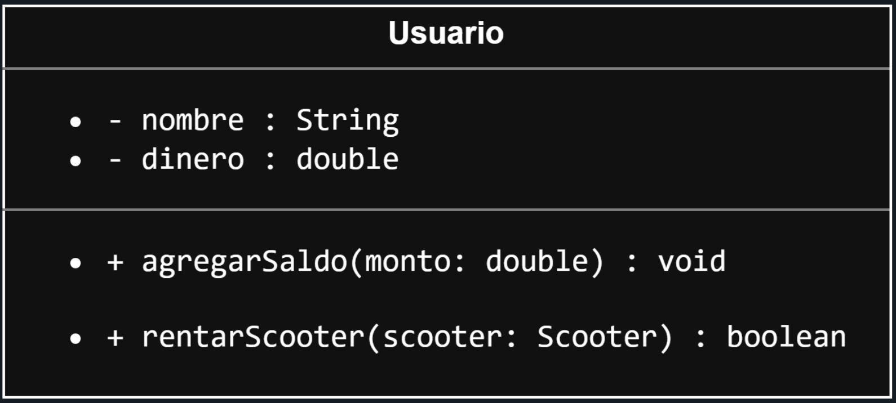
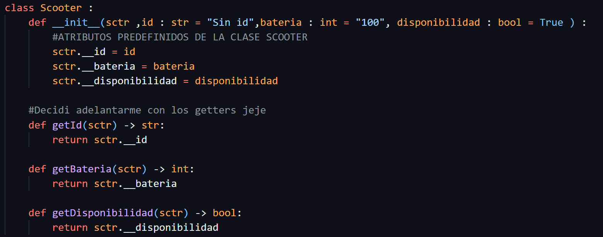
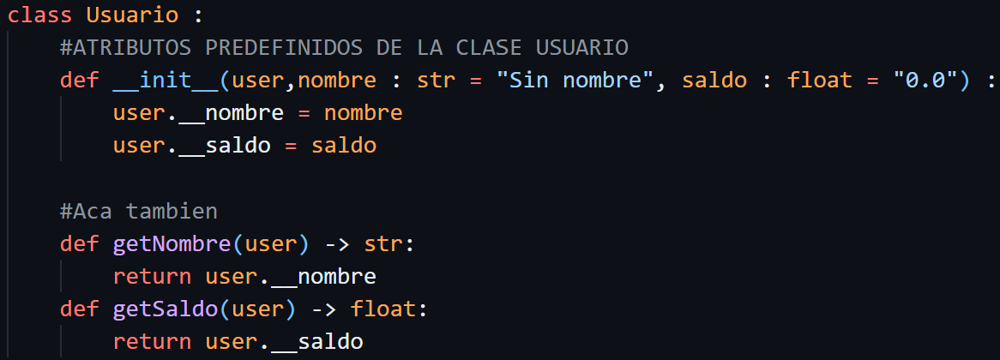

# PRIMERA ACTIVIDAD: ¿Cómo abstraer algo del mundo real a la programación?
**Caso de Estudio: Sistema de Scooters Eléctricos**

**Objetivo:** Comprender la estructura de un sistema orientado a objetos identificando clases, atributos y métodos, diferenciando el concepto abstracto (Clase) de su implementación (Objeto).

---

## Paso 1: Lectura del Caso de Estudio

Lee detenidamente la siguiente descripción del requerimiento para identificar las entidades principales del sistema.

> "Se requiere diseñar la lógica para una aplicación de renta de scooters. En el sistema, cada **Scooter** cuenta con un número de identificación (ej. 'S-001'), un nivel de batería (del 0 al 100) y un estado lógico que indica si está disponible para usarse o no. Los scooters pueden ejecutar tres acciones: desbloquearse para iniciar un viaje, terminar su viaje, y recargar su batería al 100%.
> 
> Por otro lado, la entidad **Usuario** se registra con su nombre y mantiene un saldo monetario en su cuenta. El usuario puede realizar dos acciones operativas: agregar más saldo a su cuenta y rentar un scooter específico."

---

## Paso 2: Análisis y Diccionario de Clases

Completa la siguiente estructura identificando los atributos y métodos. Recuerda que los sustantivos suelen representar Clases o Atributos, mientras que los verbos representan Métodos. Utiliza los modificadores de acceso y tipos de datos adecuados en cada línea vacía.

### Entidad 1: `SCOOTER`
**Atributos (Acceso privado `-`):**
* `- id : str ` (identificador)
* `- bateria : int ` (batería)
* `- disponibilidad : bool ` (estado de disponibilidad)

### Entidad 2: `USUARIO`
**Atributos (Acceso privado `-`):**
* `- nombre : str ` (nombre)
* `- saldo : float ` (dinero)

---

## Paso 3: Diseño del Diagrama de Clases UML

A partir de la información estructurada en el paso anterior, elabora un Diagrama de Clases formal. Asegúrate de incluir los tres bloques estándar (Nombre de la clase, Atributos y Métodos) y adjuntar la captura o imagen del diagrama resultante en tu documento.

---

## Paso 4: Instanciación (De la Teoría a la Realidad)

El diagrama de clases funciona como un molde estructural. A continuación, define instancias en memoria asignando valores concretos a los atributos de cada objeto para ejemplificar su estado.

**Instancia de Scooter 1**

**Instancia de Usuario 1**

---

## Paso 5: Pregunta de Análisis Lógico

Justifica tu respuesta a la siguiente interrogante lógica basándote en los conceptos de POO estudiados:

Si la Instancia de Usuario 1 intenta ejecutar el método `rentar()` enviando como parámetro un Scooter que tiene un 15% de batería, ¿cómo debería comportarse internamente la lógica del sistema? 

Primero se evaluaria un condicional donde se verifique el usuario tenga el saldo suficiente para rentar el scooter y llamar a la funcion iniciar viaje que tendra su npropio funcionameinto donde verificara si tiene bateria y si esta disponible, dependiendo si retorna true o false, el saldo e iniciar viaje se evaluaria con un AND para restarle al saldo del usuario el costo de rentar el scooter y retornar verdadero donde si se pudo rentar, si no se cumple con el condicional retornara falso

SECCION IA: Trate de resolverlo en IntelliJ por mi cuenta y me salio todo mal al querer acceder a dato privados desde otra entidad, muchos errores por practicar en frio, le pase mi condigo a la IA para verificar errores y resolverlos por mi propia cuentra, al final encontre mas errores por arreglar y ver de mejor manera los objetos en programacion.

---
## SECCION DE CAPTURAS
.png>)
.png>)
.png>)
.png>)
.png>)

---

> [!IMPORTANT]
> INSTRUCCIONES DE ENVÍO Y USO DE IA: 
> 1. Resuelve esta práctica y guarda tus respuestas junto con la imagen de tu diagrama UML. 
> 2. Crea un **repositorio público en GitHub** y sube tus archivos ahí. 
> 3. En el archivo **`README.md`** de tu repositorio, debes incluir obligatoriamente una sección sobre el uso de IA. **Si usaste IA:** justifica cómo te ayudó (ej. para entender un concepto, corregir sintaxis). **Si NO usaste IA:** explica brevemente cuál fue tu proceso mental para resolver el ejercicio. 
> 4. Entrega únicamente el **enlace (URL) de tu repositorio** a través de la plataforma oficial para su revisión.
